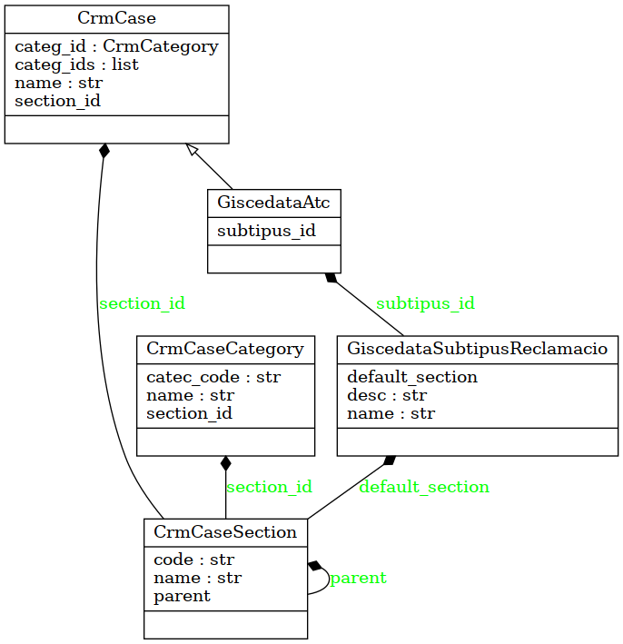

Hi ha quatre aspectes que cal quadrar perque estan col·lissionant tota l'estona:

- El model de negoci que volem implementar
- El model que implementa, de fet l'ERP
- El contingut de les taules mestres de l'ERP (Categories, Seccions, Subtipus...)
- El que tenim implementat al Callinfo

El model de l'ERP:

CrmCase: La base del cas, sigui o no reclamació. Tambe es fa servir per casos ATR.
	section_id -> CrmCaseSection.id
	name -> case.reason.split('.',1)[-1]
	categ_id -> CrmCaseCateg
	categ_ids -> CrmCaseCateg

GiscedataAtc: se añade a CrmCase si es una reclamacion
	subtipus_id -> GiscedataSubtipusReclamacio desc ~= case.reason.split('.',1)[-1]

GiscedataSubtipusReclamacio
	default_section -> CrmCaseSection
	name	'003'
	desc -> case.reason.split('.',1)[-1]

CrmCaseCateg
	complete_name: "grandparent / parent / child"
	name: "[ENTITATS I EMPRESES] Informació com contractar administradors d" (el [tag] no te a veure amb seccions, hauria?)
	categ_code  (buit)
	section_id -> CrmCaseSection
	- Les que comencen per `[` tenen section "Helpdesk"
	- Hi ha una que comença per `][`
	Se usan para listar, pero despues no se enlazan!

CrmCaseSection
	name ~= case.claimSection
	code:
	Uppercase name, code starts with ATC, parent hierarchy from "Atencio al Client"
	ATC: Atenció al Client
		ATCI: INFO
		ATCF: FACTURES
		ATCCB: COBRAMENTS
		ATCR: RECLAMACIONS
		ATCC: CONTRACTES
			ATCCA: CONTRACTES - A
			ATCCB: CONTRACTES - B
			ATCCC: CONTRACTES - C
			ATCCM: CONTRACTES - M

A revisar:

- Si replicamos los Subtipus como categories, la lista de categoria tambien incluira los subtipus
- Si no tiene la misma estructura la lista de info que de claims
	Info:  [CONSULTA] [ENTITATS I EMPRESES] Informació com contractar administradors d
	Claim: [FACTURA] 008. DISCONFORMIDAD CON CONCEPTOS FACTURADOS
- Porque el nombre de la `default_section` se parte por la '/' para generar la lista

Proposta

- Omplir el `categ_code` amb un codi, que coincidira amb el name dels subtipus quan son reclamacions, i sera un codi nou en els infos.
- El callinfo fara les cerques de categories y subtipus per aquest codi, no pas per la descripció
- Quines son les categories i subtipus bons (produccío? testing?)

Copy GiscedataSubtipusReclamacio -> CmrmCaseCateg
	default_section -> section_id
	na

select
	cat.name,
	cat.categ_code,
	sec.name,
	sec.code
from crm_case_categ as cat
left join crm_case_section as sec
on sec.id = cat.section_id ;

select
	sub.type,
	sub.name,
	sub.desc,
	sub.default_section,
	sec.code,
	sec.name
from giscedata_subtipus_reclamacio as sub
left join crm_case_section as sec
on sec.id = sub.default_section
where sec.active
;

