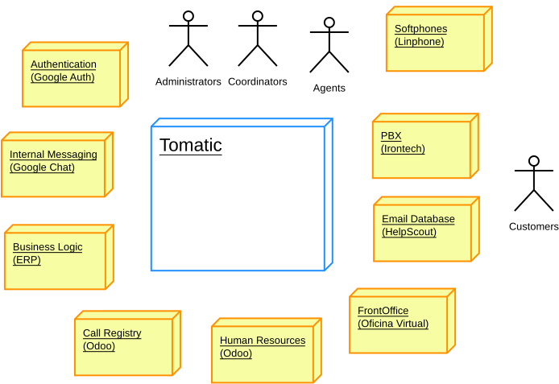

# Tomatic Arquitecture - Context Level

This document summarizes Tomatic interactions
with other entities (persons and systems).

## Persons

- Customer: Someone asking for support by phone (or other means?)
	- Not direct interaction with the system but a key role
- Agent: Someone attending support calls
- Coordinator: Someone coordinating agents work
- Administrator: Someone maintaining the platform as a system

## PBX (Irontech platform)

The PBX is a system managing incomming calls and distributing them to the agents.

Interactions:

- Tomatic will update the database of agents and their extensions to the PBX
- Tomatic will setup in the PBX the extensions (agents) attending lines in a given moment (the public attention queue)
- Tomatic will pause and resume people on the queue at request
- Tomatic will ask the PBX about statistical information (calls received/lost, timings...)
- Tomatic will ask the PBX on the current status of the queue (line status, waiting lines...)
- PBX will notify Tomatic of incomming calls as they arrive
- [NIY] PBX will notify Tomatic noticeable realtime events (agents not responding...)

## Softphones (Linphone)

Operators use the Softphones to receive calls from the PBX.

Interactions:

- No direct interaction. Extensions should match with the ones configured in Tomatic.

## ERP (Gisce ERP)

The ERP holds transactional information and performs the bussiness logic.

- Tomatic will ask bussiness information related to an incomming phone or to an specific query from the agent.
- [NIY] Tomatic will redirect the user to the ERP web frontend to start business operative

## Call registry (Odoo)

The call registry stores information about attended calls.

Interactions:

- Tomatic will register new calls as received by the PBX
- Tomatic will register typifications on calls as the agents make them
- Coordinators will query the call registry to extract insights

## Front Office (Oficina Virtual Comer)

The front office is a web application where customers can operate unattended.

Interactions:

- Tomatic will redirect agents to the OV using a hijacked user to help customers to spot problems
- [NIY] Tomatic will ask the OV for the later operations a customer has made

## Human Resources System (Odoo Laboral)

Human resources system stores information on the people working at Somenergia.
It holds information such as personal Vacations, common Holidays,
Leaves, Teams...

Interactions:

- Tomatic will aks the HRS for such information in order to plan attention timetables.

## Internal Messaging (Google Chat)

The internal messaging system is used to send real-time communication to the staff.
Allowing broadcast team and personal messages.

- Tomatic will broadcast the team via the internal messaging
	- Shift changes announcements
	- Daily stats
	- Offline agents
	- [NIY] Improcedent behaviours
	- Custom messages from coordinators
- Tomatic will send personal message to the agents
	- Shift changes

## Mailbox system (HelpScout)

The mailbox system enables coordinated team response to incomming email.

Interactions:

- Tomatic can redirect the user to a search of emails related with a given customer
- [NIY] Tomatic can show a list of email comunications with a given customer

## Authentiation server (Google Auth)

TODO: At some point it will be a selfhosted Authentik

The authentication server is used to authenticate agents, coordinators and administrators.

Interaction:

- Callinfo will redirect user to the Auth server for them to autheticate themselves.

-----

[NIY]:() Not yet implemented

