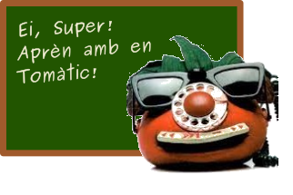
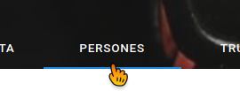
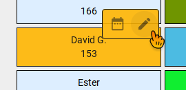
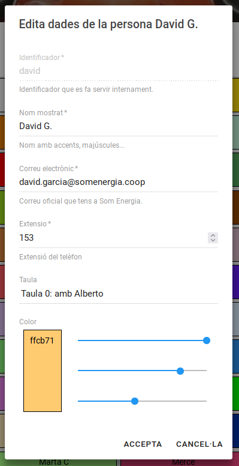
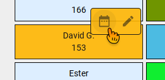
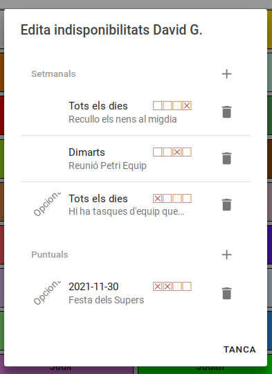
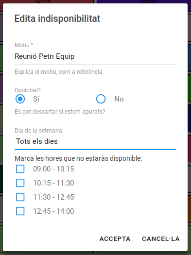
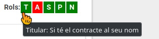

_Note:
The target of those guides were our staff.
That's why those tutorials are either in Catalan or Spanish.
Also because of that the videos are stored in our coorporate Google Drive
and are not accessible to every one.
We have no reason to keep them private, just few time to publish them.
If you need them, just do a request._

# Guies i vídeos d'usuaria

- [Accedir al Tomàtic](#accedir-al-tomàtic)
- [Editar el perfil d'usuaria](#editar-el-perfil-dusuaria)
- [Donar d'alta una persona](#donar-dalta-una-persona)
- [Marcar les meves indisponibilitats](#marcar-les-meves-indisponibilitats)
- [Definir la meva taula](#definir-la-meva-taula)
- [Pestanya "centraleta"](#pestanya-centraleta)
- [Informació de trucada entrant](informacio-de-trucada-entrant)

I pròximament

- Navegar per les graelles
- Canviar torns de la graella
- Anotació de trucades
- Generar càrregues setmanals de telèfon
- Generar les graelles

## Accedir al Tomàtic

Important: Heu de tenir activada la VPN coorporativa.

http://tomatic.somenergia.lan

## Editar el perfil d'usuaria

Per canviar el perfil d'usuaria cal

- anar a la pestanya "Persones",

- posar el cursor al damunt de la caixeta amb el teu nom,
- clicar a l'icona del _llapis_

	

- ens surt aquest dialeg:

Els camps que hi ha són

- **Identificador:** No es pot canviar perquè ha de coincidir amb el que hi ha a l'excel d'atenció i suport.
- **Nom a mostrar:** És el nom que es veu arreu.
- **Correu:** Ha de ser el correu coorporatiu que teniu a l'Odoo (per reservar-vos les vacances)
- **Extensió:** És la extensió telefònica que us assigna l'equip de suport a la centraleta
- **Taula:** Amb qui esteu asseguts per evitar tenir torns a l'hora. ([Més info](#definir-la-meva-taula))
- **Color:** El color de la vostra caixeta per trobar-vos més fàcilment

## Donar d'alta una persona

La darrera caixa de la pestanya "Persones" és per crear nous perfils.

Us sortirà el mateix diàleg que per .
Però ara heu de posar un identificador.
Aquest identificador, ha de coincidir amb el nom que poseu al full de càlcul del Drive on es posen les càrregues ideals.

Quan afegiu la nova persona al Drive enrecordeu-vos de ajustar
els _intervals amb nom_:

- `carregaideal_noms` ha de cobrir tots els identificadors
- `carregaideal_valors` ha de cobrir les càrregues ideals en el mateix ordre que els noms

## Marcar les meves indisponibilitats

Podem demanar al Tomàtic que no ens posi telèfon a certs torns (indisponibilitats).
**Les vacances que heu demanat a l'Odoo ja es tenen en compte i no cal posar-les.**
Les indisponibilitats que caldria indicar al Tomàtic
són les degudes a l'horari laboral que teniu, reunions, tasques d'equip, conciliacio familiar, viatges de treball...

Les indisponibilitats es demanen a la **pestanya "Persones"**,
clicant la **icona calendari** que surt quan ens posem al damunt de la teva caixa.

Ens surt aquest diàleg:

Hi ha dos grups: les **puntuals** (només un dia) i les que es repeteixen **setmanalment**.
Indicareu per unes el dia concret i per les altres el dia de la setmana.

Si clickeu en un `+` o en una indisponibilitat existent us sortirà aquest diàleg:

És important que indiqueu el **motiu**.
El motiu ens ajuda a identificar indisponibilitats que ja no tenen sentit,
i que potser no ens deixen trobar una solució a la graella.

També és important marcar si la indisponibilitat és **opcional**, que vol dir _negociable_.
En Tomàtic evitarà trencar el mínim d'indisponibilitats opcionals.
Pero si no hi ha cap més remei trencarà algunes.
En canvi, les no opcionals fan que una graella no sigui viable.
Per viabilitzar graelles en situacions complicades,
és important posar que es negociable quan ho és.

Les indisponibilitats son efectives en el moment de generar graelles.
**Si la graella ja està generada**, podeu negociar amb les companyes
i fer el canvi directament a la graella.
Els canvis que feu queden visibles al registre de sota de la graella.

**[La funcionalitat de bossa d'hores esta actualment desactivada]**
Totes les agents tenim una proporció de torns assignada depenent del nostre equip i antiguitat.
Si per disponibilitats o per canvis a graella, acabem fent més o menys,
en Tomàtic s'ho guarda per compensar-ho a les següents graelles que es generin.
No es guarda per compensar, els canvis fets directament a la cua (pauses, o afegides),
només els fets a la graella.

## Definir la meva taula

Dos companyes fent a l'hora telèfon a prop pot provocar l'_efecte coctel_
i que ens costi entendre i atendre a qui truca.
En Tomàtic pot fer les graelles evitant que les persones a la mateixa taula
tinguin telèfon al mateix temps.
Per això, cal que les dues persones configurin que estan a la mateixa taula a les seves fitxes d'usuaria.

Es configura al perfil d'usuaria.
S'accedeix a la pestanya "Persones", posant-nos al damunt de l'usuaria
i clicant a l'icona del _llapis_ que apareix.

Al camp 'Taula', normalment tindrem seleccionat "Sense taula".
Podem escollir una de les que estan definides, o definir-ne una de nova.

## Pestanya "Centraleta"

La pestanya "Centraleta" mostra les agents que estan rebrent trucades en cada moment, li diem "la cua".
Cada caixeta es pinta d'una forma diferent depenent de l'estat de l'agent.
Al video anterior pots veure una cua amb agents en tots els estats possibles:

- L'Alberto està en una trucada (caixa aixecada, amb ombra)
- En Pol està disponible (caixa normal)
- La Joana esta desconnectada (caixa voltada)
- A en David li esta entrant una trucada ara (caixa vibrant)
- I la Judith està pausada (caixa tatxada)

Si no t'enrecordes, quin estat es quin, pots posar el ratolí al damunt i et dirà quin estat és.
A part de veure com està, podem modificar la cua:

- Si clico al damunt d'una companya la pausaré
- Si clico a algú pausat li trec la pausa
- El quadre lila amb el signe `+` es per afegir a algú més a la cua quan cal més penya.

La cua es recarrega a cada canvi de torn (un quart i 1 hora).
Tota la gent afegida extra es treu però es mantenen les pauses
si l'agent repeteix torn.

## Informació de trucada entrant

Aquest tutorial explica com fer servir la pestanya de trucada entrant.

La pestanya 'Trucada' te informació sobre les trucades que anem rebent.
Fa cerques automàtiques per telèfon quan rebem una trucada nova
o quan cliquem una trucada al llistat de trucades rebudes de l'esquerra.

![](callinfo.png"/>

Si pel telèfon no troba ningú podem fer una cerca manual per qualsevol altre criteri.

De cada cerca, podem trobar varies persones.
De la persona que tenim seleccionada, veiem els contractes relacionats.
I del contracte seleccionat les seves factures, lectures, casos atr...

**El correu de la persona és un enllaç als correus que hem rebut pel HelpScout.**

Cada contracte, indica el rols que hi te la persona seleccionada.

El botó amb un portapapers a la llista de persones serveix per anotar la trucada
seleccionada a l'esquerra amb la persona i el contracte seleccionats.

Si volem afegir una anotació extra podem deseleccionar la trucada
i anotar igualment.

Quan no hem acabat de treballar amb una trucada i ens pot arribar una altra
podem fer servir el botó del _cadenat_, per que no salti la cerca de la següent trucada,
i el boto amb la _fletxeta sortint de la caixa_ per obrir una nova pestanya
de Tomàtic sense bloquejar per rebre les noves.

